# Alien Protocol
## RWA Lending Infrastructure on Stellar

> Production-grade Real World Asset (RWA) collateralized lending infrastructure built on Stellar and Soroban.

---

# Table of Contents

1. Vision
2. Problem Statement
3. Solution Overview
4. System Architecture
5. Core Protocol Flow
6. Smart Contract Architecture
7. Backend Architecture
8. Database Design
9. Oracle System
10. Liquidation Engine
11. Risk Management
12. API Design
13. Frontend Architecture
14. Security Design
15. Infrastructure & DevOps
16. Development Roadmap
17. Grant Strategy
18. Repository Structure
19. Future Roadmap
20. Technical Stack
21. KPIs & Metrics
22. Conclusion

---

# 1. Vision

Alien Protocol aims to become the foundational RWA credit infrastructure layer on Stellar.

The protocol enables users to:

- Deposit tokenized real-world assets as collateral
- Borrow USDC or XLM against those assets
- Maintain healthy collateral positions
- Avoid liquidation through automated risk monitoring
- Access transparent on-chain lending markets

The long-term vision is to build:

- Institutional-grade lending infrastructure
- Programmable collateral systems
- RWA liquidity rails on Stellar
- Open credit markets for tokenized assets

---

# 2. Problem Statement

The Stellar ecosystem currently lacks:

- Production-grade RWA lending infrastructure
- Collateralized borrowing systems
- Liquidation automation
- Oracle infrastructure for RWAs
- Credit markets for tokenized assets
- Risk engines for asset-backed lending

Most lending protocols focus on:

- speculative crypto assets
- overcollateralized DeFi primitives
- generic token markets

Very few protocols focus on:

- tokenized treasury assets
- invoice financing
- tokenized real estate
- yield-bearing RWAs
- institutional lending rails

---

# 3. Solution Overview

Alien Protocol provides:

## Core Features

### Collateralized Borrowing
Users deposit RWA-backed assets and borrow against them.

### Automated Liquidation
Unhealthy positions are liquidated automatically.

### Oracle-Based Pricing
Collateral values are continuously updated.

### Risk Engine
Dynamic LTV and health factor monitoring.

### Event Indexing
Full protocol state indexing and analytics.

### Production Backend
Rust-based backend services for indexing, monitoring, and liquidation.

---

# 4. System Architecture

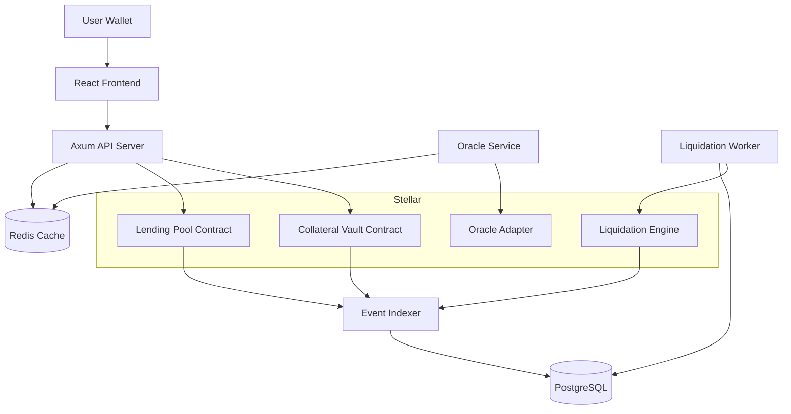

---

# 5. Core Protocol Flow

## Complete System Flow

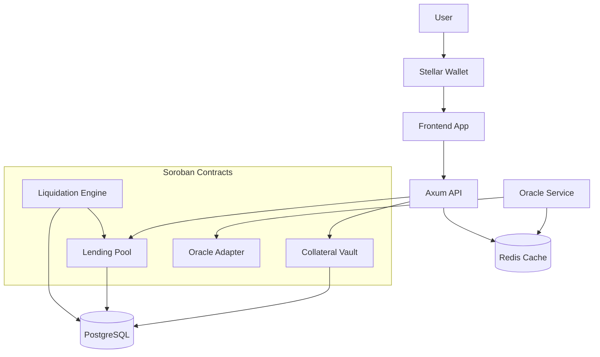

---

## Collateral Deposit Flow

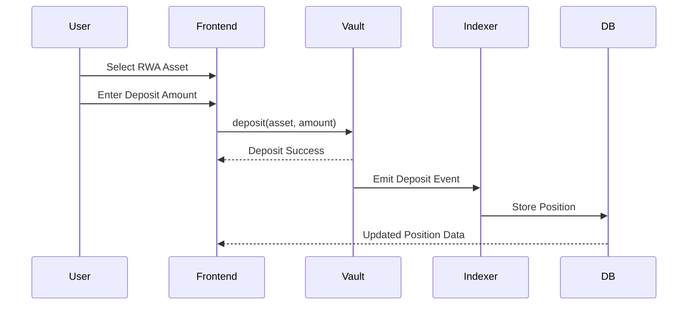

---

## Borrow Execution Flow

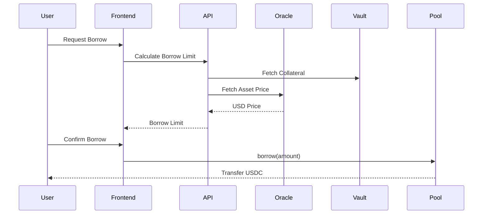

---

## Repayment Flow

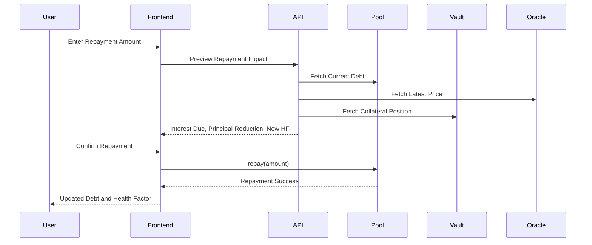

---

## Health Factor Monitoring Flow

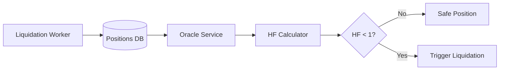

---

## Liquidation Execution Flow

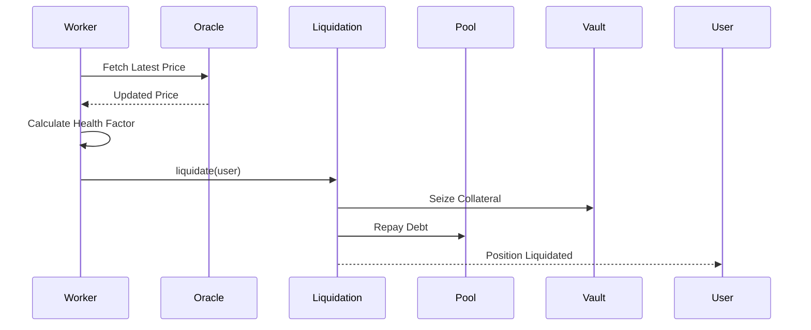

---

## Oracle Update Flow

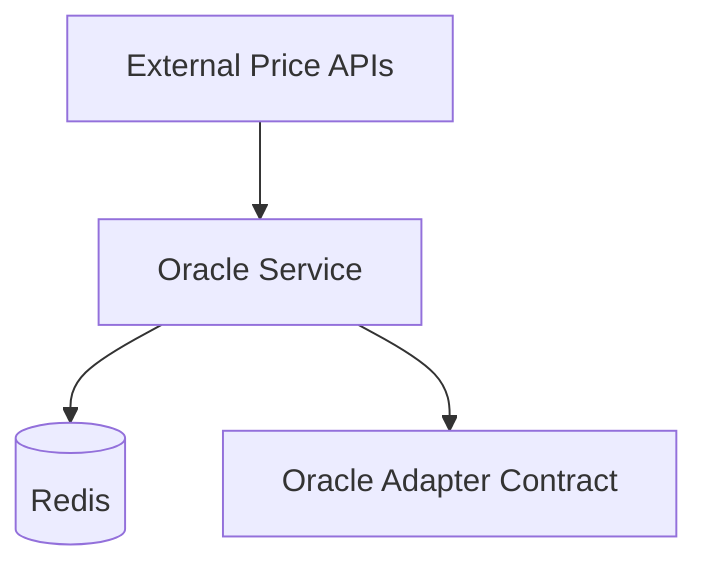

---

## Event Indexing Flow

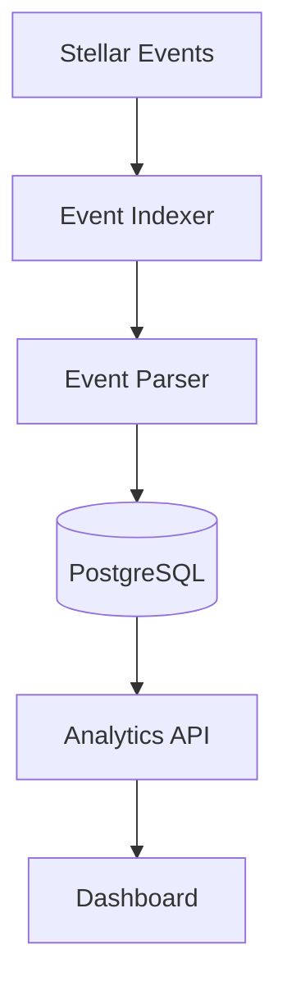

---

## Infrastructure Deployment Flow

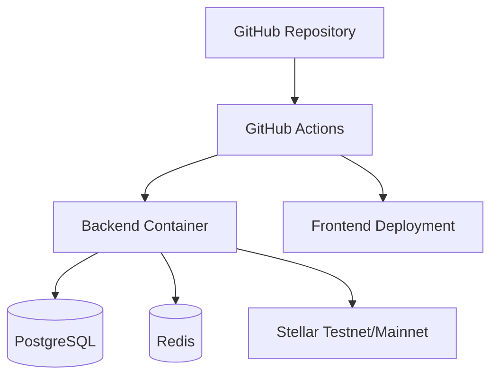

---


## Borrow Flow

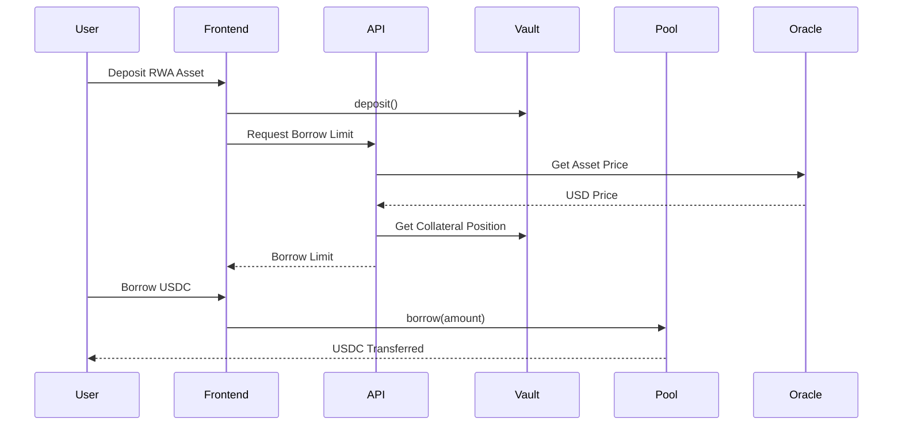

---

## Liquidation Flow

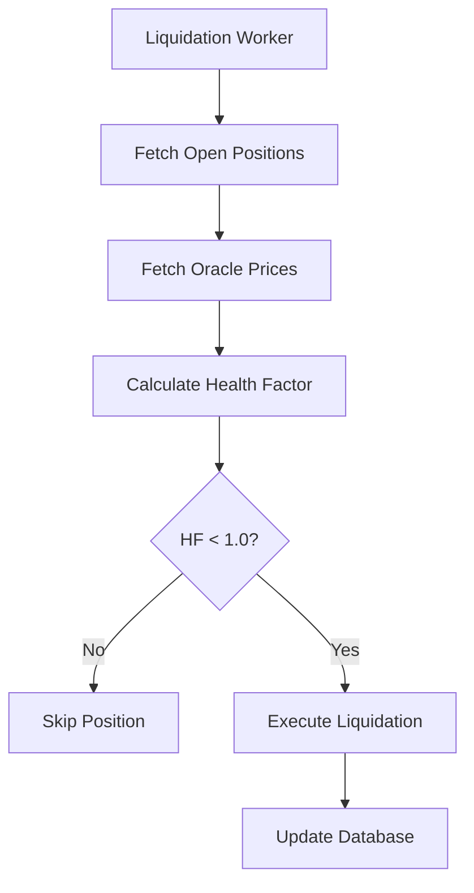

---

# 6. Smart Contract Architecture

The protocol consists of four primary Soroban smart contracts.

---

## 6.1 Collateral Vault Contract

### Responsibilities

- Accept collateral deposits
- Store user positions
- Track collateral balances
- Allow collateral withdrawals
- Validate collateral ratios

### Core Functions

```rust
fn deposit(user: Address, asset: Address, amount: i128)
fn withdraw(user: Address, asset: Address, amount: i128)
fn get_position(user: Address) -> Position
fn get_collateral_value(user: Address) -> i128
```

---

## 6.2 Lending Pool Contract

### Responsibilities

- Manage borrowing
- Track debt positions
- Handle repayments
- Accrue interest over time
- Track utilization
- Manage pool liquidity

### Interest Rate Model

Alien Protocol V1 uses a fixed APR model so the first production contract is simple, auditable, and predictable.

- Borrow APR: 8% fixed annualized for USDC-denominated debt in V1
- Accrual model: linear accrual on each debt interaction and liquidation check
- Time basis: per-second accrual using ledger timestamp
- Upgrade path: utilization-based variable rates can be introduced in V2

### Debt Accounting Rules

- Each debt position stores `principal`, `accrued_interest`, `interest_rate_bps`, and `last_accrual_at`
- Total debt is derived as `principal + accrued_interest`
- Interest is accrued before every `borrow`, `repay`, `liquidate`, and `get_debt` read
- Repayments apply interest first, then principal
- Partial repayment is allowed as long as the remaining debt stays above a protocol minimum debt size

### Accrual Formula

```txt
elapsed_seconds = now - last_accrual_at
interest = principal * rate_bps / 10_000 * elapsed_seconds / 31_536_000
total_debt = principal + accrued_interest + interest
```

### Core Functions

```rust
fn borrow(user: Address, asset: Address, amount: i128)
fn repay(user: Address, asset: Address, amount: i128)
fn get_debt(user: Address) -> Debt
fn calculate_limit(user: Address) -> i128
fn accrue_interest(user: Address) -> Debt
```

---

## 6.3 Liquidation Engine

### Responsibilities

- Monitor unhealthy positions
- Execute liquidations
- Seize collateral
- Repay protocol debt
- Support permissionless liquidators
- Operate with the backend worker as a backstop

### Liquidation Design

Liquidation should not depend solely on the backend worker. The contract must be callable permissionlessly by any address that detects an unhealthy position.

- Primary mode: permissionless liquidation by third parties
- Backstop mode: backend liquidation worker submits when no external liquidator acts
- Liquidation bonus: 8% of collateral seized is paid to the liquidator
- Protocol liquidation reserve is optional for V1 and not required for the core design

### Full vs Partial Liquidation

Alien Protocol V1 uses partial liquidation by default.

- Trigger condition: `HF < 1.0`
- Target post-liquidation health factor: `1.10`
- Close factor: maximum 50% of outstanding debt can be repaid in one liquidation call
- Fallback: if the remaining position would be dust-sized or still unsafe, full liquidation is allowed

This reduces liquidator capital requirements and protects users better than all-or-nothing liquidation.

### Core Functions

```rust
fn liquidate(user: Address, max_repay_amount: i128)
fn is_liquidatable(user: Address) -> bool
fn calculate_bonus(repaid_amount: i128) -> i128
fn calculate_partial_repayment(user: Address) -> i128
```

---

## 6.4 Oracle Adapter

### Responsibilities

- Read oracle prices
- Validate price freshness
- Manage supported assets
- Prevent stale price attacks
- Restrict price updates to approved publishers

### Access Control

The Oracle Adapter is a trust-sensitive contract and must have explicit publisher controls.

- `update_price` may only be called by a whitelisted oracle publisher address
- Admin role is controlled by multisig
- Admin can rotate the publisher address without redeploying the contract
- Every price update stores `updated_at`, `publisher`, and asset identifier
- Contract rejects updates older than the last accepted timestamp
- Contract exposes an emergency pause for oracle writes if a feed is compromised

### Core Functions

```rust
fn get_price(asset: Address) -> PriceData
fn update_price(asset: Address, price: i128)
fn is_price_fresh(asset: Address) -> bool
fn set_publisher(publisher: Address)
fn pause_oracle_updates()
```

---

# 7. Backend Architecture

The backend is critical.

Most Web3 projects stop at smart contracts.
Alien Protocol includes production backend infrastructure.

---

## Services

| Service | Responsibility |
|---|---|
| API Server | REST endpoints |
| Oracle Service | Fetch and cache prices |
| Event Indexer | Parse Stellar events |
| Liquidation Worker | Monitor unhealthy positions |
| Notification Service | Alerts and notifications |

---

## Backend Stack

```txt
Rust
Axum
Tokio
PostgreSQL
Redis
SQLx
Tracing
Docker
```

---

## Backend Flow

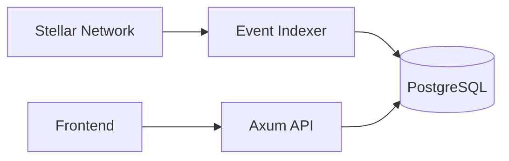

---

# 8. Database Design

## Tables

### positions

| Column | Type |
|---|---|
| id | UUID |
| user_address | TEXT |
| collateral_asset | TEXT |
| collateral_amount | NUMERIC |
| collateral_value_usd | NUMERIC |
| status | TEXT |
| created_at | TIMESTAMP |
| updated_at | TIMESTAMP |

---

### debts

| Column | Type |
|---|---|
| id | UUID |
| position_id | UUID |
| principal | NUMERIC |
| accrued_interest | NUMERIC |
| interest_rate_bps | INTEGER |
| last_accrual_at | TIMESTAMP |
| status | TEXT |
| created_at | TIMESTAMP |
| updated_at | TIMESTAMP |

---

### liquidations

| Column | Type |
|---|---|
| id | UUID |
| user_address | TEXT |
| collateral_seized | NUMERIC |
| debt_repaid | NUMERIC |
| tx_hash | TEXT |
| executed_at | TIMESTAMP |

---

## Database Notes

- `health_factor` must not be stored in `positions`; it is derived from live collateral value, liquidation threshold, and current total debt
- `collateral_value_usd` may be cached for analytics, but liquidation logic must always recompute value from the latest accepted oracle price
- `total_debt` should be derived at read time from `principal + accrued_interest + pending_accrual`
- `created_at` and `updated_at` are required for positions and debts to support analytics, audits, and recovery workflows
- Position history should come from indexed contract events rather than mutable row snapshots alone

# 9. Oracle System

Oracle infrastructure is the most important risk component.

---

## Oracle Phases

### Phase 1 — Mock Oracle

- hardcoded prices
- admin-controlled updates
- suitable for MVP
- publisher allowlist enabled from day one

---

### Phase 2 — Centralized Oracle

- backend price fetching
- Redis caching
- periodic updates
- single approved publisher wallet managed by multisig
- update cadence target: every 30 seconds for supported assets

---

### Phase 3 — Aggregated Oracle

- multiple sources
- median price calculation
- staleness protection
- publisher rotation without redeploy
- confidence threshold checks before on-chain submission

---

## Oracle Risks

| Risk | Mitigation |
|---|---|
| stale prices | freshness validation |
| manipulation | median aggregation |
| downtime | cached prices |
| invalid feeds | emergency pause |

---

# 10. Liquidation Engine

The liquidation system protects protocol solvency.

---

## Health Factor Formula

\[
HF = \frac{CollateralValue \times LiquidationThreshold}{Debt}
\]

### Example

```txt
Collateral Value = $10,000
Liquidation Threshold = 80%
Debt = $7,500

HF = (10000 × 0.8) / 7500
HF = 1.066
```

Safe Position.

---

## Liquidation Rules

| Health Factor | Status |
|---|---|
| HF > 1.5 | Very Safe |
| HF > 1.0 | Safe |
| HF < 1.0 | Liquidatable |

---

### Liquidation Parameters

- Liquidation threshold is asset-specific and derived from risk configuration
- Liquidation bonus is fixed at 8% in V1
- Target recovery health factor after partial liquidation is `1.10`
- Close factor is 50% of outstanding debt per liquidation call
- Total debt used in liquidation checks must include freshly accrued interest

---

## Liquidation Worker

Runs every 60 seconds.

### Responsibilities

- fetch positions
- calculate health factors
- trigger liquidations
- store liquidation events

The worker is a safety backstop, not the only liquidation path. If the worker is offline, permissionless liquidators can still call the liquidation contract directly.

---

# 11. Risk Management

## LTV Ratios

| Asset Type | Max LTV |
|---|---|
| Treasury RWAs | 70% |
| Real Estate | 60% |
| Invoice Assets | 50% |
| XLM | 50% |

---

## Security Mechanisms

- emergency pause
- stale oracle protection
- admin role separation
- replay protection
- liquidation threshold enforcement
- input validation

---

# 12. API Design

## REST API

### Positions

```http
GET /api/positions/:user
```

### Borrow Limit

```http
GET /api/borrow-limit/:user
```

### Pool Stats

```http
GET /api/pool/stats
```

### Liquidations

```http
GET /api/liquidations
```

---

## Authentication Model

The frontend uses two trust channels:

- Soroban wallet signing for on-chain actions such as `deposit`, `borrow`, `repay`, `withdraw`, and `liquidate`
- API authentication for backend reads that need rate limiting, analytics personalization, or privileged previews

V1 API auth uses signed Stellar wallet challenges exchanged for short-lived JWTs.

### Auth Flow

1. Frontend requests a challenge from the API
2. User signs the challenge with their Stellar wallet
3. API verifies the signature and issues a short-lived JWT
4. Frontend includes the JWT in subsequent API requests

Read-only public endpoints may stay unauthenticated, but any user-scoped endpoint should support signed auth from the start.

# 13. Frontend Architecture

## Stack

```txt
Next.js
React
TypeScript
TailwindCSS
Stellar Wallet SDK
```

---

## Features

### Dashboard

- collateral value
- debt positions
- health factor
- borrow limits

### Borrow Interface

- borrow USDC
- repay debt
- transaction states
- repayment preview with interest-first breakdown
- health factor preview before and after borrow or repay

### Analytics

- TVL
- utilization
- liquidation history

---

# 14. Security Design

## Primary Attack Vectors

| Attack | Risk |
|---|---|
| oracle manipulation | incorrect liquidations |
| stale prices | undercollateralized debt |
| replay attacks | duplicated tx execution |
| admin compromise | protocol takeover |
| invalid withdrawals | pool insolvency |

---

## Security Controls

- multisig admin
- contract pausing
- strict validation
- oracle freshness checks
- event logging
- audit preparation

---

# 15. Infrastructure & DevOps

## Infrastructure

```txt
Docker
GitHub Actions
Vercel
Fly.io or Railway
Managed Postgres
Managed Redis
Prometheus
Grafana
```

## Hosting Target

For a solo developer grant-ready deployment, the default production target is:

- Frontend: Vercel
- API, indexer, oracle service, and liquidation worker: Fly.io or Railway
- Database: managed PostgreSQL
- Cache: managed Redis

This keeps operations simple while preserving enough production realism for testnet and early mainnet phases.

## Rough Monthly Cost

| Component | Estimated Cost |
|---|---|
| Frontend hosting | $0-$20 |
| Backend containers | $20-$60 |
| Managed Postgres | $15-$40 |
| Managed Redis | $10-$25 |
| Monitoring / logs | $0-$20 |
| Total | ~$45-$165 / month |

This is useful context for grant reviewers evaluating sustainability.

---

## Deployment Architecture

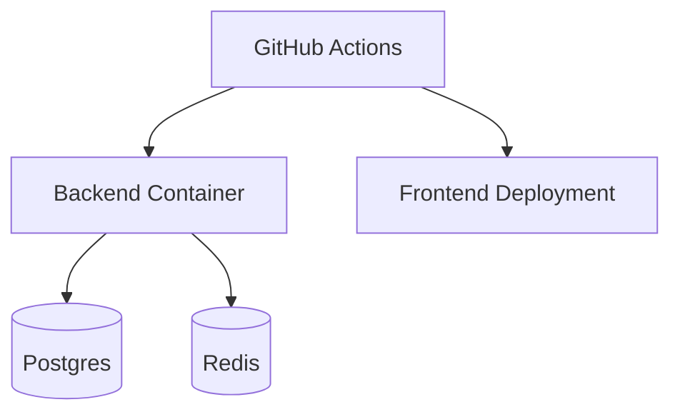

---

# 16. Development Roadmap

# Phase 0 — Research

Duration: 1 Week

### Tasks

- protocol architecture
- DB schema
- risk model
- contract flow diagrams

---

# Phase 1 — Smart Contracts

Duration: 4 Weeks

### Week 1

- Collateral Vault
- deposit/withdraw
- storage design

### Week 2

- Lending Pool
- borrow/repay
- debt accounting
- fixed APR accrual
- interest-first repayment ordering

### Week 3

- liquidation engine
- health factor
- LTV enforcement
- partial liquidation logic
- permissionless liquidator path

### Week 4

- contract testing
- edge cases
- integration tests

---

# Phase 2 — Backend

Duration: 4 Weeks

### Week 5

- Axum setup
- PostgreSQL
- Redis

### Week 6

- Oracle Service
- Event Indexer
- signed auth challenge endpoint

### Week 7

- Liquidation Worker
- liquidation backstop logic
- price freshness monitoring

### Week 8

- analytics APIs
- caching
- optimization

---

# Phase 3 — Frontend

Duration: 3 Weeks

### Week 9

- dashboard
- wallet connection

### Week 10

- borrow/repay flow

### Week 11

- analytics page
- liquidation history

---

# Phase 4 — Production Engineering

Duration: 3 Weeks

### Week 12

- tracing
- metrics
- health checks

### Week 13

- security review
- threat documentation

### Week 14

- deployment
- CI/CD
- testnet launch

---

# 17. Grant Strategy

## When To Apply

DO NOT apply with only an idea.

Apply after:

- contracts deployed
- backend running
- frontend accessible
- liquidation demonstrated
- documentation complete

---

## Best Timing

### Weeks 12–15

This is the ideal grant application window.

Include a short operating-cost appendix in the application so reviewers can see the backend is deployable by a solo builder.

---

## Grant Targets

| Stage | Target |
|---|---|
| Early MVP | Hackathons |
| Testnet Demo | Stellar Community Fund |
| Post-MVP | Accelerators |
| Growth Stage | Seed Funding |

---

# 18. Repository Structure

```txt
alien-protocol/
│
├── contracts/
│   ├── collateral-vault/
│   ├── lending-pool/
│   ├── liquidation-engine/
│   └── oracle-adapter/
│
├── backend/
│   ├── api/
│   ├── indexer/
│   ├── liquidation-worker/
│   ├── oracle-service/
│   └── migrations/
│
├── frontend/
│
├── docs/
│   ├── architecture.md
│   ├── risk-model.md
│   ├── api.md
│   └── security.md
│
├── scripts/
│
├── docker-compose.yml
│
└── README.md
```

---

# 19. Future Roadmap

## V2

- decentralized oracle aggregation
- multi-collateral positions
- protocol revenue model
- utilization-based variable interest rates

---

## V3

- institutional API layer
- governance system
- liquidation marketplace
- insurance fund

---

## V4

- cross-chain collateral
- tokenized treasury integration
- permissioned credit pools

---

# 20. Technical Stack

| Layer | Stack |
|---|---|
| Smart Contracts | Soroban + Rust |
| Backend | Rust + Axum |
| Database | PostgreSQL |
| Cache | Redis |
| Frontend | Next.js |
| Infrastructure | Docker |
| Monitoring | Prometheus + Grafana |
| CI/CD | GitHub Actions |

---

# 21. KPIs & Metrics

## Protocol Metrics

- Total Value Locked (TVL)
- Total Borrowed
- Utilization Rate
- Liquidation Volume
- Number of Active Positions
- Average Health Factor
- Interest Accrued
- Partial vs Full Liquidation Ratio

---

## Engineering Metrics

- API latency
- indexer lag
- liquidation execution time
- oracle freshness
- failed transaction count

---

# 22. Conclusion

Alien Protocol is designed as:

- production-grade lending infrastructure
- RWA-focused DeFi system
- Stellar-native credit layer
- backend-heavy protocol architecture

The project emphasizes:

- protocol engineering
- backend infrastructure
- financial risk systems
- scalability
- observability
- security

Rather than building another speculative DeFi clone, Alien Protocol focuses on creating real infrastructure for tokenized real-world assets on Stellar.
